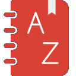

<h1 align="center">

<strong>Lexicon</strong></h1>

**An efficiant Dictionary add-on for Firefox** (availble soon for chrome and edge )

* Quickly Define Words While You Browse By Just Double Clicking
* Effortlessly Expand Your Vocabulary
* Create and Organize Your Own Word Bank With Personal Dictionary
* Learn to Pronounce with Pronunciation Support
* Memorize Effortlessly with Flash Cards _(Availble Soon)_
* Language Switcher To Qucickly Switch Between Languages

***

 

***

Lexicon extension for Firefox makes reading a breeze! No more interruptions to search for word meanings. Double-click any word and instantly view its definition in a pop-up bubble. Stay focused on what you're reading and expand your vocabulary effortlessly.

## Features
---
* Instant word definition
* Customizable trigger 
    * Only Double Click
    * Ctrl + Double Click
    * Alt + Double Click
    * Shift + Double Click
    * Hightlight and Right Click
* Multiple Definitions Upto 5
* Word history
* Pronunciation Support
* Download word history as JSON
* Multilingual support
    * English
    * French 
    * German
    * Spanish
    * Hindi
    * Brazilian portuguese
    * Portuguese
* Dark Mode
* Fast and lightweight

## Get Involved
---
This tool is under active development. To get involved you can watch the repo, file issues, create pull requests, or ask a question.

## License
---
[GPLv3](./LICENSE)

---
## Changelog 1.5.5
- Fixed autoplay issue introduced in v1.5.0
- Enhanced user interface
- Added part of speech identification for words
- Improved handling of words with identical spellings across multiple languages

## Changelog 1.5.0

- **Language Persistence:** Language switcher now retains selected language on a per-page basis.  
- **More Link Issue Fix:** Resolved an issue with the functionality of the "More" link.  
- **Language Reversion Fix:** Addressed the issue where language settings reverted to default after switching.  
- **Pronunciation Overlap Fix:** Fixed overlapping voices in pronunciation following a language switch.

## Changelog 1.4.0 

* Added Dark Mode support for Popup and Personal Dicitionary.
* Introduced a System Option for theme customization.
* Resolved an issue where the definition popup extended beyond the screen.
* Added autoplay functionality for pronunciation.

> Thanks to <a href="https://github.com/DenB10">@DenB10</a> for adding dark mode to personal dictionary and system theme support.
